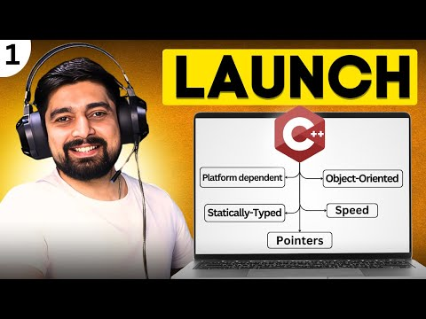

  

# ☕ Chai Aur C++

- “From syntax to systems — one cup of C++ at a time.”

# Introduction

Chai Aur C++ marks the beginning of my journey into the world of C++ programming, starting today with the C++ course by Hitesh Choudhary Sir from Chai aur Code (YouTube).

This repository documents everything I learn — from fundamentals to advanced concepts — as I work to upskill my knowledge in C++ and strengthen my problem-solving and programming foundation.

# My Goals

- Master the core fundamentals and syntax of C++

- Learn Object-Oriented Programming (OOP) concepts deeply

- Explore and apply Standard Template Library (STL)

- Solve Data Structures and Algorithms (DSA) problems efficiently

- Build mini projects for hands-on experience and practical learning

# Repository Structure
  - Documentation	Notes, syntax breakdowns, and explanations of C++ topics
  - Assignments	Coding exercises and problem-solving practice
  - Projects	Small projects built to apply and test learning

# Tech Stack
 - Git & GitHub	Version control and progress tracking
 - OOP Concepts	Classes, objects, inheritance, polymorphism, encapsulation
 - STL (Standard Template Library)	Containers, iterators, algorithms
 - DSA (Data Structures & Algorithms)	Problem solving and algorithm design
 - VS Code / Xcode / g++	IDE and compiler for writing, compiling, and testing code
   
# Connect With Me

 - GitHub: @Harsz06

 - Email:	guleriah59@gmail.com

 - YouTube Course:	C++ by Hitesh Choudhary (Chai aur Code)
